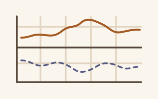

<!-- Profile draft for BshKatrin/BshKatrin. Not published.
     Thumbnails are integrated. Add verified public project/write-up links
     before using this as the final profile. See DESIGN.md and ASSET-BRIEF.md.
     Keep completed academic work separate from the current Master's projects.
     BirdCLEF and NLP report links currently point to local LaTeX sources;
     replace them with public PDF links before publishing the profile repo.
-->

# Hi, I'm Kat

*Short for Ekaterina. Kat in everyday life, Ekaterina on paper.*

I'm studying Machine Learning, AI & Data Science at Sorbonne Université.

LLMs and their agentic capabilities have become a big part of how I work. I love experimenting with custom MCP integrations and reusable skills to speed up development, make learning more productive, and make collaboration easier.

## Selected work

<!-- Theme-aware thumbnails follow ASSET-BRIEF.md.
     Do not link to the 404 URLs from the historical inventory.
-->

<picture>
  <source media="(prefers-color-scheme: dark)" srcset="assets/projects/ood-dark.svg">
  <source media="(prefers-color-scheme: light)" srcset="assets/projects/ood-light.svg">
  
</picture>

### Detecting the unfamiliar

**Model distillation for OOD detection · ISIR research internship, 2026**

During my summer internship, I explored whether model distillation could help detect **out-of-distribution (OOD)** data. I studied whether teacher–student disagreement and embedding reconstruction could identify inputs outside a vision model's training distribution, and compared our results with those reported in scientific papers.

SLURM · Python · PyTorch · OOD evaluation

<picture>
  <source media="(prefers-color-scheme: dark)" srcset="assets/projects/birdclef-dark.svg">
  <source media="(prefers-color-scheme: light)" srcset="assets/projects/birdclef-light.svg">
  
</picture>

### Listening to biodiversity

**BirdCLEF+ 2026 Challenge: audio classification · Two-person academic project 👤👤 · 2026**

> **This is my hardest pure ML project so far, and the one I'm most proud of.**
>
> Have a look at our [report source →](../my-path/reports/Projet_ML_BirdClef2026/main.tex) to see how we approached it.

Our professors gave us one main restriction: no deep neural networks. The goal was to see how far we could push classical ML models.

BirdCLEF was a tough introduction to audio ML: **1.68M training windows**, a large shift from clean training recordings to noisy test soundscapes, many underrepresented species, and species present in the test set but absent from the training set. Audio was also a type of data we hadn't worked with before.

We started with logistic regression, used species taxonomy to build a hierarchical classifier, and customised the **scikit-learn** mini-batch training loop with weighted sampling and a custom weighted loss. We then developed a multi-stage classification pipeline to adapt the predicted probabilities to soundscapes, achieving our best result of **0.749 ROC-AUC on noisy soundscapes** with classical ML.

<picture>
  <source media="(prefers-color-scheme: dark)" srcset="assets/projects/nlp-dark.svg">
  <source media="(prefers-color-scheme: light)" srcset="assets/projects/nlp-light.svg">
  
</picture>

### Reading between sentences

**NLP classification & sequence modelling · Two-person academic project 👤👤 · 2026**

This project involved two tasks: binary sentiment classification of movie reviews, and the much harder task of identifying the speaker in sentences from French presidential speeches. In the second dataset, consecutive sentences belonged to the same speech. To improve performance, we had to go beyond independent predictions and model the context and continuity between sentences.

🥇 Our favourite pipeline combined CamemBERT and BiLSTM models, achieving **0.899 F1 in grouped out-of-fold evaluation** and earning us **first place on the course project leaderboard**.

PyTorch · RNN (BiLSTM) · Transformers (CamemBERT)

[Report source →](../my-path/reports/RITAL_NLP_Projet-2/main.tex) · [Code →](https://github.com/BshKatrin/RITAL-NLP-project)

<picture>
  <source media="(prefers-color-scheme: dark)" srcset="assets/projects/recommender-dark.svg">
  <source media="(prefers-color-scheme: light)" srcset="assets/projects/recommender-light.svg">
  
</picture>

### Recommending with reasons

**[Explainable board-game recommender](https://github.com/Franciline/Recommendation_system) · Three-person academic research project 👤👤👤 · 2025**

The goal was to build an explainable recommendation system from board-game information, reviews and user profiles scraped from the French website TricTrac in 2023. Our working dataset contained **96,533 reviews of 2,614 games**.

We explored collaborative filtering methods, including k-NN and matrix factorisation, and worked on explaining the recommendations. For each game, we wanted to predict the rating a user might give and produce a review-like explanation of why they might enjoy it — or dislike it. Along the way, we experimented with embeddings, clustering, a local LLM, and NLP evaluation methods such as ROUGE and BLEU.

To demonstrate the results, we also built a Dash app with interactive 3D cluster exploration rendered using **deck.gl**, configured through **pydeck** and embedded with **dash-deck**.

Local LLM (Ollama) · Clustering · Python · Recommender systems · NLP · Dash · deck.gl

[Report →](https://github.com/Franciline/Recommendation_system/blob/main/reports/Project_Report.pdf) · [Demo →](https://github.com/Franciline/Recommendation_system/blob/main/reports/Preview_video.mp4)

<picture>
  <source media="(prefers-color-scheme: dark)" srcset="assets/projects/hirag-dark.svg">
  <source media="(prefers-color-scheme: light)" srcset="assets/projects/hirag-light.svg">
  
</picture>

### Following the right paths

**HiRAG paper reproduction & improvement · Three-person academic project 👤👤👤 · 2026**

For this project, we reproduced the graph-based RAG pipeline from a scientific paper and tried to improve how it selects the information passed to the LLM. HiRAG combines local knowledge-graph evidence with global community summaries, but a limited context window makes the choice of what to keep particularly important.

We experimented with selecting more relevant passages, adding ColBERT reranking, and making connections between local and global information depend on the question. We compared weighted Dijkstra, minimax and Monte Carlo Tree Search (MCTS), and evaluated our variants on two UltraDomain corpora with both LLM judgement and human annotation.

The most interesting lesson was that **better graph paths do not automatically give better answers**: useful source text can still be crowded out by summaries. This project made me look more critically at retrieval, context budgets, and how we actually evaluate a RAG system.

GraphRAG · ColBERT · Dijkstra · Minimax · MCTS · RAG evaluation

[Presentation slides →](reports/hirag-final-presentation.pptx)

## Building now

<picture>
  <source media="(prefers-color-scheme: dark)" srcset="assets/projects/telemetry-dark.svg">
  <source media="(prefers-color-scheme: light)" srcset="assets/projects/telemetry-light.svg">
  
</picture>

**[MXChip room telemetry](https://github.com/BshKatrin/mxchip-room-telemetry)** — my personal project for keeping an eye on my room's temperature, pressure and humidity. I wanted to see how bad things got during Paris's summer heatwaves, even while I was away at my internship.

MXChip → FastAPI → InfluxDB → Grafana · C/C++ · Docker

<!-- Confirm the current milestone before adding a "Next:" sentence.
     Repository contains a small Rust sensor/data-preparation crate; don't imply
     it is the verified on-device production path without confirmation.
     Add at most two named current university projects here once supplied.
     Add a separate "Next" subsection only for a concrete planned project.
-->
