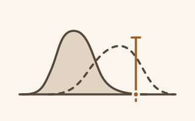
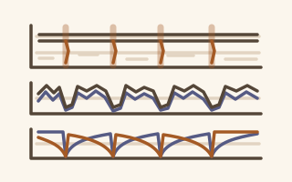
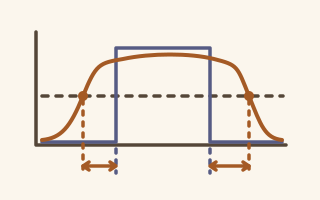
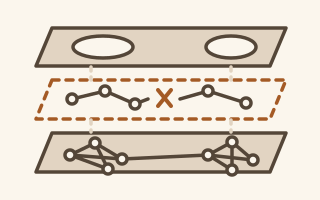
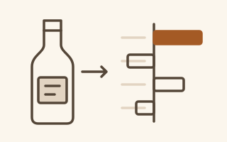
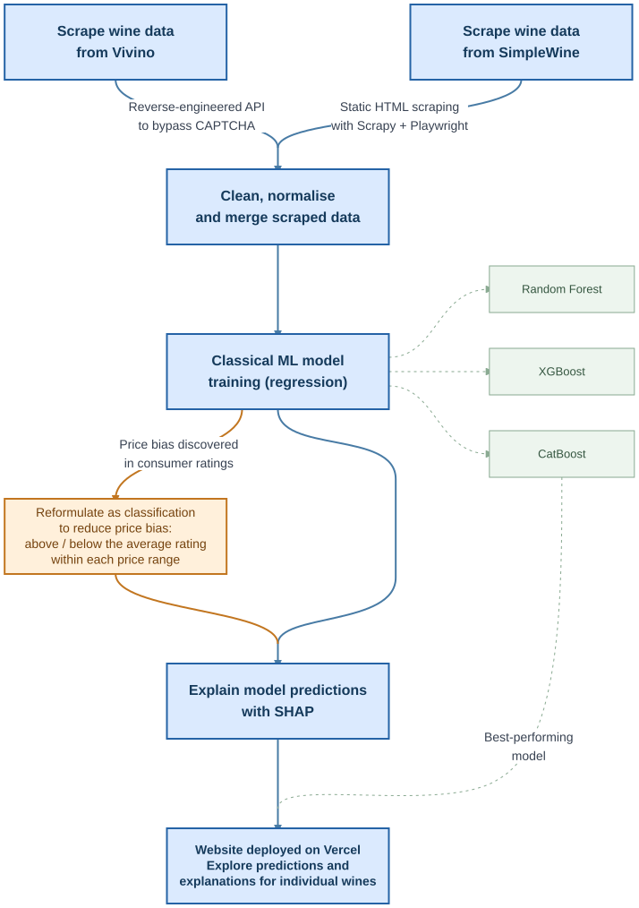
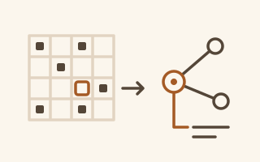
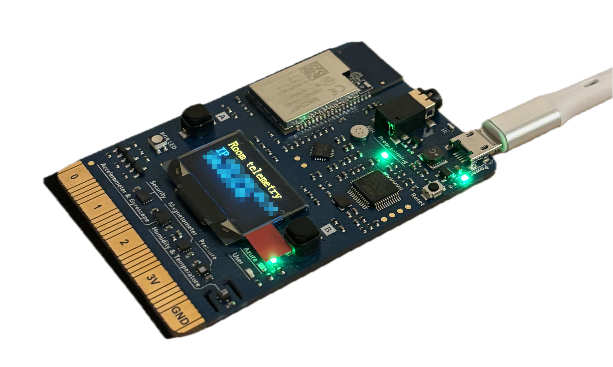

<!-- Profile draft for BshKatrin/BshKatrin. Not published.
     Thumbnails are integrated. Add verified public project/write-up links
     before using this as the final profile. See DESIGN.md and ASSET-BRIEF.md.
     Keep completed academic work separate from the current Master's projects.
     BirdCLEF and NLP report links currently point to local LaTeX sources;
     replace them with public PDF links before publishing the profile repo.
-->

# Hi, I'm Kat

*Short for E**kat**erina*

I'm studying Machine Learning, AI & Data Science at Sorbonne Université.

LLMs and their agentic capabilities have become a big part of how I work. I love experimenting with custom MCP integrations and reusable skills to speed up development, make learning more productive, and make collaboration easier.

## ML related projects

<!-- Theme-aware thumbnails follow ASSET-BRIEF.md.
     Do not link to the 404 URLs from the historical inventory.
-->

<picture>
  <source media="(prefers-color-scheme: dark)" srcset="assets/projects/ood-dark.svg">
  <source media="(prefers-color-scheme: light)" srcset="assets/projects/ood-light.svg">
  
</picture>

#### [Detecting the unfamiliar](https://github.com/BshKatrin/distill-ood-detection)

**Model distillation for OOD detection · [ISIR](https://www.isir.upmc.fr/) research internship, 2026**

Exploring teacher-student disagreement and embedding reconstruction for out-of-distribution detection.

Research approach

During my summer internship, I explored whether model distillation could help detect **out-of-distribution (OOD)** data. I studied whether teacher-student disagreement and embedding reconstruction could identify inputs outside a vision model's training distribution, and compared our results with those reported in scientific papers.

SLURM · Python · PyTorch · OOD evaluation

[Presentation slides →](https://github.com/BshKatrin/distill-ood-detection/blob/main/reports/presentations/internship/presentation.pdf)

---

<picture>
  <source media="(prefers-color-scheme: dark)" srcset="assets/projects/birdclef-dark.svg">
  <source media="(prefers-color-scheme: light)" srcset="assets/projects/birdclef-light.svg">
  
</picture>

#### [Listening to biodiversity](https://github.com/glouno/birdclef_2026_ML)

**[BirdCLEF+ 2026 Challenge](https://www.kaggle.com/competitions/birdclef-2026): audio classification · 👤👤-person academic project · 2026**

> **This is my hardest pure ML project so far, and the one I'm most proud of.**
>
> Have a look at our [report source →](https://github.com/glouno/birdclef_2026_ML/blob/master/rapport.pdf) to see how we approached it.

Classical ML for biodiversity audio, with a best result of **0.749 ROC-AUC on noisy soundscapes**.

Challenge and approach

Our professors gave us one main restriction: no deep neural networks. The goal was to see how far we could push classical ML models.

BirdCLEF was a tough introduction to audio ML: **1.68M training windows**, a large shift from clean training recordings to noisy test soundscapes, many underrepresented species, and species present in the test set but absent from the training set. Audio was also a type of data we hadn't worked with before.

We started with logistic regression, used species taxonomy to build a hierarchical classifier, and customised the **scikit-learn** mini-batch training loop with weighted sampling and a custom weighted loss. We then developed a multi-stage classification pipeline to adapt the predicted probabilities to soundscapes, achieving our best result of **0.749 ROC-AUC on noisy soundscapes** with classical ML.

---

<picture>
  <source media="(prefers-color-scheme: dark)" srcset="assets/projects/nlp-dark.svg">
  <source media="(prefers-color-scheme: light)" srcset="assets/projects/nlp-light.svg">
  
</picture>

#### [The Road to First Place: Sentiment & Speakers](https://github.com/BshKatrin/RITAL-NLP-project)

**NLP classification & sequence modelling · 👤👤-person academic project · 2026**

🥇 Our best pipeline combined CamemBERT and BiLSTM models, achieving **0.899 F1 in grouped out-of-fold evaluation** and earning us **1st place on the course project leaderboard**.

Tasks and approach

This project involved 2 tasks:

1. Classical binary sentiment classification of movie reviews
2. Much harder task of predicting the speaker in sentences from French presidential speeches

In the second dataset, consecutive sentences belonged to the same speech. To improve performance, we had to go beyond independent predictions and model the sequential dependency between consecutive sentences.

PyTorch · RNN (BiLSTM) · Transformers (CamemBERT)

[Report source →](https://github.com/BshKatrin/RITAL-NLP-project/blob/main/report.pdf)

---

<picture>
  <source media="(prefers-color-scheme: dark)" srcset="assets/projects/hirag-dark.svg">
  <source media="(prefers-color-scheme: light)" srcset="assets/projects/hirag-light.svg">
  
</picture>

#### [Strengthening the Local-Global Bridge](https://github.com/glouno/RITAL-IR-project/)

**[HiRAG](https://arxiv.org/abs/2503.10150) paper reproduction & improvement · 👤👤-person academic project · 2026**

Improving retrieval and connections between local and global knowledge in a graph-based RAG pipeline.

Experiments and evaluation

For this project, our goal was to improve the scientific paper in the Information Retrieval domain. Chosen paper: [Retrieval-Augmented Generation with Hierarchical Knowledge](https://arxiv.org/abs/2503.10150).

We experimented with:

- Improving ranking of retrieved relevant passages with ColBERT-based (latent attention) reranking
- Improving bridge construction between local and global knowledge with weighted Dijkstra, minimax and Monte Carlo Tree Search (MCTS).

We evaluated performance with:

- LLM-as-a-judge evaluation
- Human annotation

GraphRAG · ColBERT · Dijkstra · Minimax · MCTS

[Presentation slides →](https://github.com/glouno/RITAL-IR-project/blob/master/presentation.pdf)

---

<picture>
  <source media="(prefers-color-scheme: dark)" srcset="assets/projects/wine-dark.svg">
  <source media="(prefers-color-scheme: light)" srcset="assets/projects/wine-light.svg">
  
</picture>

#### [Decoding the bottle](https://github.com/BshKatrin/Wine-Quality---DALAS)

**Wine rating prediction & interpretation · 👤👤-person academic project · 2025**

What shapes a wine's rating? We wanted to discover the main factors that drive consumer preferences, using only information available to the average consumer: price, winery, alcohol content, etc.

Unlike many uni projects, this one started from scratch: the dataset wasn’t handed to us, so we had to collect and clean the data ourselves. The project then took an unexpected turn: we discovered a strong bias in the data and reframed the problem to try to address it.

A sneak peek at our project timeline

<picture>
  <source media="(prefers-color-scheme: dark)" srcset="assets/projects/wine-workflow-dark.svg">
  
</picture>

Python · Scrapy · Playwright · Data cleaning · Imputation · Classical ML · SHAP · React · TypeScript · Vercel

 

[Report →](https://github.com/BshKatrin/Wine-Quality---DALAS/blob/main/reports/DALAS_wine_project.pdf) · [Website →](https://decodingthebottle.ekat.world/)

---

<picture>
  <source media="(prefers-color-scheme: dark)" srcset="assets/projects/recommender-dark.svg">
  <source media="(prefers-color-scheme: light)" srcset="assets/projects/recommender-light.svg">
  
</picture>

#### [Recommending with reasons](https://github.com/Franciline/Recommendation_system)

**Explainable board-game recommender · 👤👤👤-person academic research project · 2025**

Explaining board-game recommendations with collaborative filtering, NLP and an interactive Dash app.

Methods and demo

The goal was to build an explainable recommendation system from board-game information, reviews and user profiles scraped from the French website TricTrac in 2023.

We explored collaborative filtering methods, including k-NN and matrix factorisation, and worked on explaining the recommendations. For each game, we wanted to predict the rating a user might give and produce a review-like explanation of why they might enjoy it - or dislike it. Along the way, we experimented with embeddings, clustering, a local LLM, and NLP evaluation methods such as ROUGE and BLEU.

To demonstrate the results, we also built a Dash app with interactive 3D cluster exploration rendered using **deck.gl**, configured through **pydeck** and embedded with **dash-deck**.

Local LLM (Ollama) · Clustering · Python · Recommender systems · NLP · Dash · deck.gl

[Report →](https://github.com/Franciline/Recommendation_system/blob/main/reports/Project_Report.pdf) · [Demo →](https://github.com/Franciline/Recommendation_system/blob/main/reports/Preview_video.mp4)

---

## Software & IoT projects

<picture>
  
</picture>

#### Keeping an eye on my room

**[MXChip room telemetry](https://github.com/BshKatrin/mxchip-room-telemetry) · Personal project**

Tracking room temperature, pressure and humidity with MXChip, FastAPI, InfluxDB and Grafana.

Why I built it

My personal project for keeping an eye on my room's temperature, pressure and humidity. I wanted to see how bad things got during Paris's summer heatwaves, even while I was away at my internship. Currenly deployed on AWS architecture.

MXChip → FastAPI → InfluxDB → Grafana · C/C++ · Docker

## Current focus & next up

| Course | Project Name | Description |
| --- | --- | --- |
| Methodology in Data Science and Research | [τ²-bench analysis](https://arxiv.org/pdf/2506.07982v1) | Looking for weaknesses and biases in this LLM agent benchmark, and exploring how to achieve strong scores at a lower cost. |
| Reinforcement Learning | Mini-project: Overestimation bias in DDPG and TD3 on LunarLander | Studying how layer normalization affects Q-value overestimation and how that bias affects performance. |
| Reinforcement Learning | Mini-project: DAgger vs balanced sampling in SuperTuxKart | Comparing DAgger and balanced sampling to see which trains an agent to complete a solo lap faster. |
| Reinforcement Learning | Project: SuperTuxKart driving competition | Designing our own RL training strategy and experimenting to find what makes our driving agent competitive against other teams in SuperTuxKart. |
| Explainable AI | Critical reading of XAI research papers | Analysing explainable AI papers to identify their strengths and limitations. |
